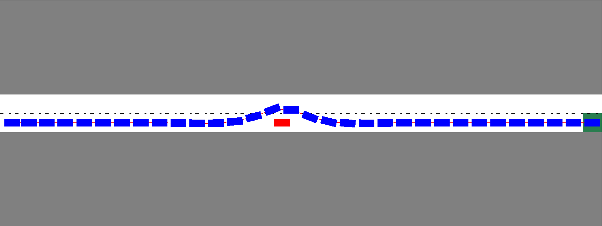
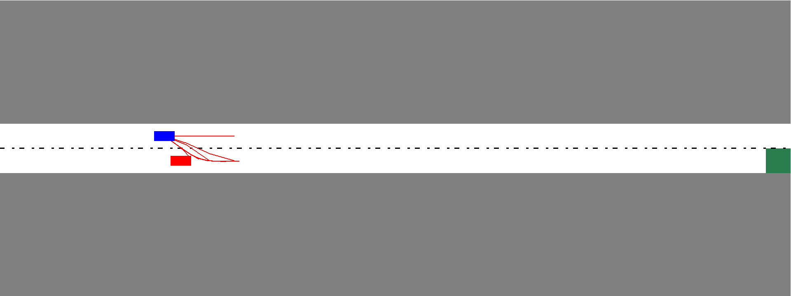

# autonomous-driving-decision-making
This is an C++ implementation of lane change decision making in simulated autonomous driving, path planning and markov decision process as well as particle filters are considered for vehicle intention prediction.

To run this program, you need to install OpenGL package, and then please use

```
mkdir build
cd build
cmake ..
make
./simulation
```

If you have any problems in linking the glfw, you can uncomment in the makelsit file and change it path of glfw to your library folder, this is only the folder to my glfw lib.

```
link_directories(/usr/local/Cellar/glfw/3.2.1/lib)
```


The hybrid A* search algorithm not only use the graph based A* search algorithm but alos includes the veicle dynamic constraint in path planning. A possible search path to avoid static and dynamic object is:


In order to make right decision making, it is possible to search for multiple path and then select the best path:



The color changes reflect the driver intention changes when observing the lane change signal.

